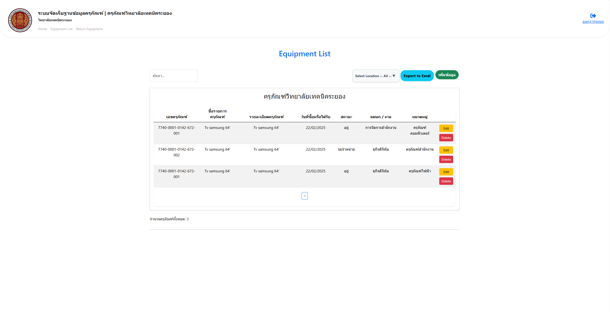

# 📦 Equipment Inventory System

A web-based system for managing and tracking equipment Inventory within an organization. Designed to help staff and administrators monitor inventory, update equipment data, and streamline record-keeping.

---

## 📌 Features

- ✅ User authentication (admin & viewer roles)
- 📋 Add, edit, delete, and view equipment details
- 📊 Dashboard showing recent equipment
- 📁 Department/location dropdown for categorizing
- 🌐 Web-based system accessible from anywhere

---

## 🖼️ Screenshot



---

## 🚀 Getting Started

### 1. Clone the repository

```bash
git clone https://github.com/fammie1/Equipment_Invrntory_System.git
cd 
